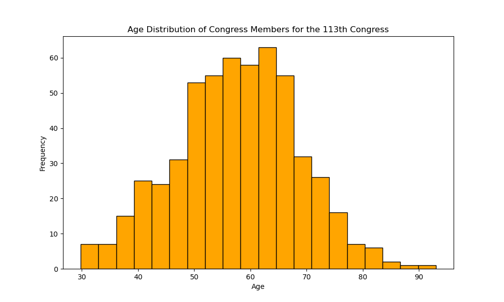

 # This is a README for IDS 706 Mini Project 3

### Status Badges 


### Project Motivation:
This project creates a Python script that utilizes the Polars package to generate descriptive statistics and the Matplotlib package to produce data visualizations. 


### Data Used in this Project:
This project uses data on U.S. Congressional members gathered by FiveThirtyEight. 

Data was accessed from the following GitHub repository: https://github.com/fivethirtyeight/data/blob/master/congress-age/congress-terms.csv

### Functions Created in this Project
    1. read_congressdata() - this function reads in the North Carolina voter registration data, and accounts for both the value of the first row being column names and the raw file being tab-delimited.
    2. mean_age() - this function identifies the age column in the DataFrame and calculates the mean age.
    3. median_age() - this function identifies the age column in the DataFrame and calculates the median age.
    4. std_age() - this function identifies the age column in the DataFrame and calculates the standard deviation of age.
    5. generate_hist_member_age_bycongress() - this function creates a histogram of ages for U.S. Congressional Members as filtered for a specific Congress

### Example -- Data Visualization


### Project Directory
```
PeterdeGuzman_Mini3/
├── __pycache__/
├── .devcontainer/
│   ├── devcontainer.json
│   └── Dockerfile
├── .pytestcache/
├── .ruff_cache/
├── __pycache__
├── .github/
│   └── workflows/
│       ├── format.yml
│       ├── install.yml
│       ├── lint.yml
│       └── test.yml
├── mylib/
│   └── lib.py
├── Output Images/
│       ├── test_histogram.png
│       └── 113th_congress.png
├── .gitignore
├── main.html
├── main.ipynb
├── main.pdf
├── main.py
├── Makefile
├── README.md
├── Requirements.txt
├── test_lib.py
└── test_main.py
```

