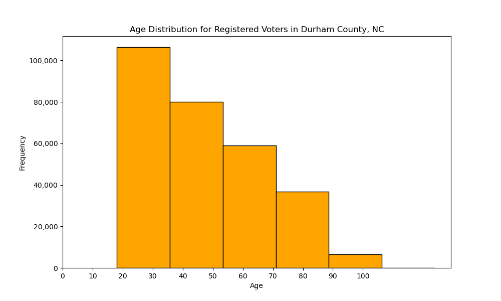

 # This is a README for IDS 706 Individual Project 1

### Status Badges 

### Youtube Video:


### Project Motivation:
This project creates a Python script that utilizes the Pandas package to generate descriptive statistics and the Matplotlib package to produce data visualizations. 


### Data Used in this Project:
This project uses a subset of voter registration data for Durham County, North Carolina made available by the North Carolina State Board of Elections. This data was downloaded as a zipped file on September 16th, 2024. 

More information and a link to the data is available at: https://www.ncsbe.gov/results-data/voter-registration-data

### Functions Created in this Project
    1. read_csv_ncvoterdata() - this function reads in the North Carolina voter registration data, and accounts for both the value of the first row being column names and the raw file being tab-delimited.
    2. mean_age() - this function identifies the age column in the DataFrame and calculates the mean age.
    3. median_age() - this function identifies the age column in the DataFrame and calculates the median age.
    4. std_age() - this function identifies the age column in the DataFrame and calculates the standard deviation of age.
    5. generate_histogram_age() - this function identifies the age column in the DataFrame and createss a histogram to display the age distribution for a sample of registered voters in the county of interest. 
    6. generate_pop_pyramind() 

### Example -- Data Visualization

Note: This data was sampled from the Tyrell County, North Carolina dataset on registered voters, and is not representative of the population. 

### Project Directory
```
PeterdeGuzman_IndividualProject1/
├── .devcontainer/
│   ├── devcontainer.json
│   └── Dockerfile
├── .github/
│   └── workflows/
│       ├── main.yml
├── .pytest_cache
├── .ruff_cache
├── .gitignore
├── main.ipynb
├── main.py
├── Makefile
├── ncvoter89.txt
├── output.png
├── README.md
├── Requirements.txt
└── test_main.py
```

